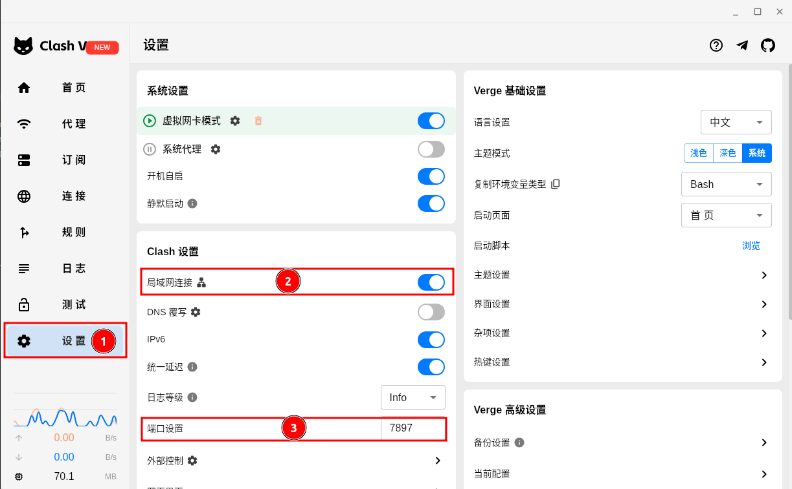
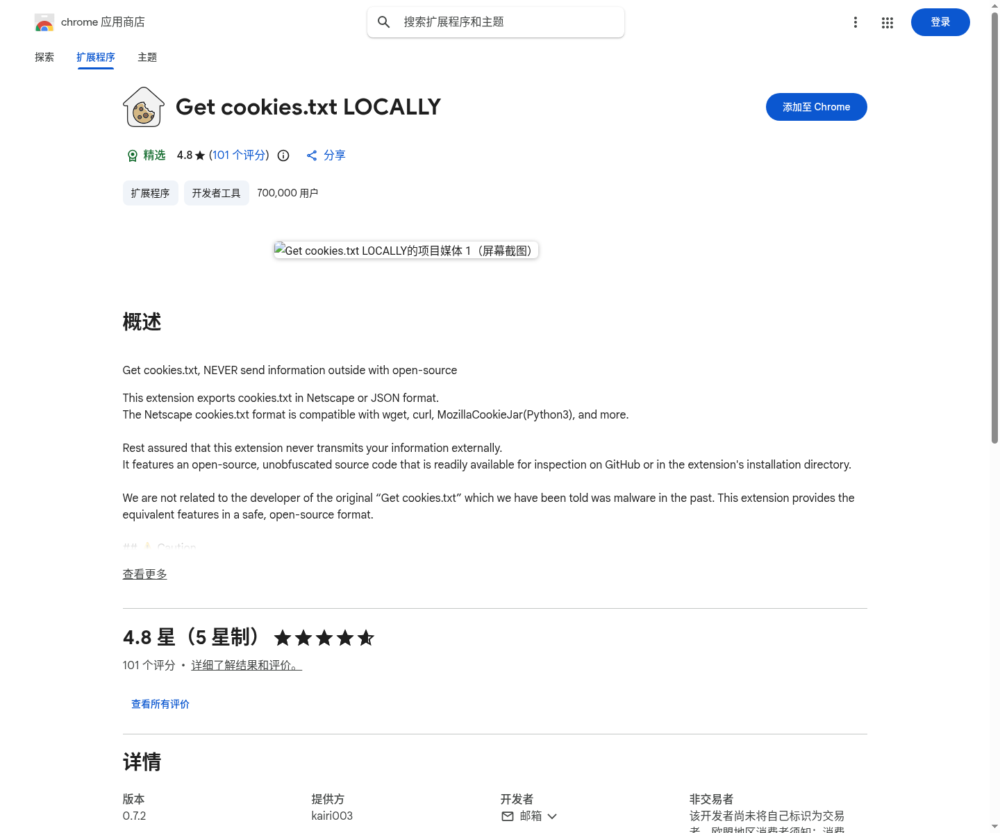
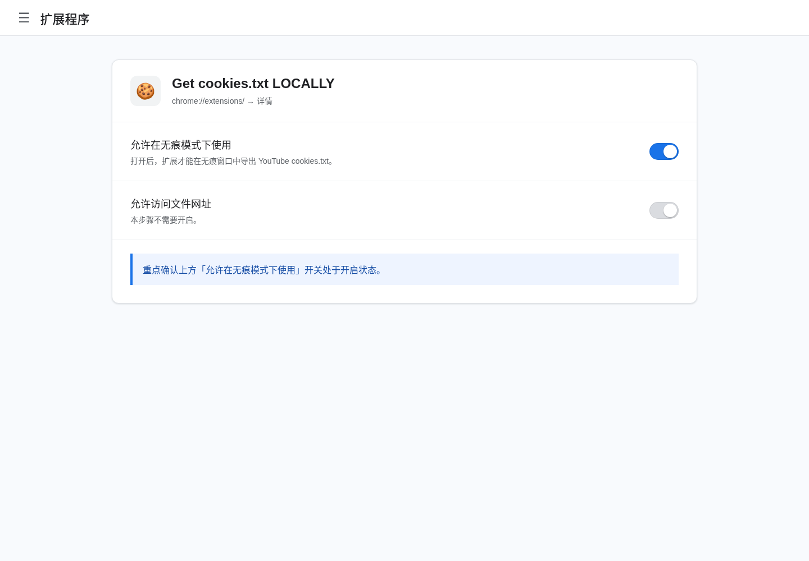
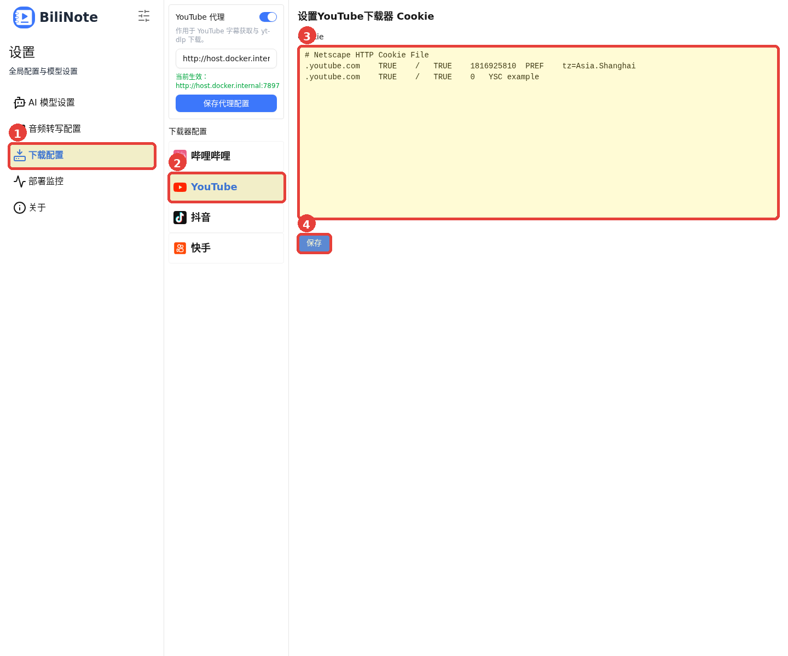
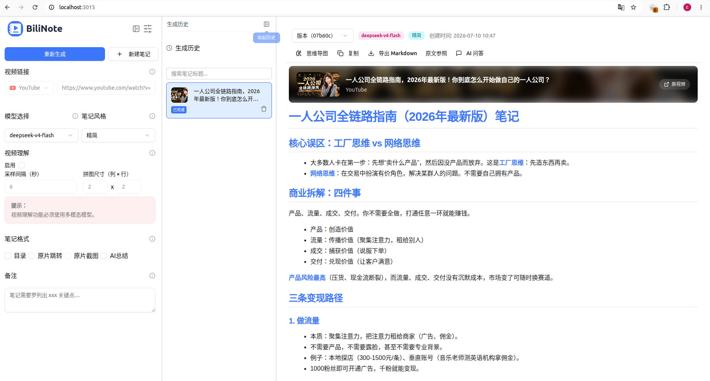

# BiliNote Docker 部署与 YouTube 配置说明

这份文档记录当前这套 Docker 部署方式，重点覆盖国内网络环境、YouTube 代理、YouTube Cookie、AI 代理拆分，以及推送到个人 GitHub 仓库的流程。

## 1. 安装 Docker

Ubuntu 22.04 推荐使用 Docker 官方源：

```bash
sudo apt remove -y docker.io docker-compose docker-compose-v2 docker-doc podman-docker containerd runc
sudo apt update
sudo apt install -y ca-certificates curl

sudo install -m 0755 -d /etc/apt/keyrings
sudo curl -fsSL https://download.docker.com/linux/ubuntu/gpg -o /etc/apt/keyrings/docker.asc
sudo chmod a+r /etc/apt/keyrings/docker.asc

echo \
  "deb [arch=$(dpkg --print-architecture) signed-by=/etc/apt/keyrings/docker.asc] https://download.docker.com/linux/ubuntu \
  $(. /etc/os-release && echo "${UBUNTU_CODENAME:-$VERSION_CODENAME}") stable" | \
  sudo tee /etc/apt/sources.list.d/docker.list > /dev/null

sudo apt update
sudo apt install -y docker-ce docker-ce-cli containerd.io docker-buildx-plugin docker-compose-plugin
```

允许当前用户直接执行 Docker：

```bash
sudo usermod -aG docker "$USER"
newgrp docker
```

验证：

```bash
docker version
docker compose version
```

## 2. 配置 Docker Hub 镜像加速

国内访问 Docker Hub 容易超时，建议配置 daemon 镜像加速：

```bash
sudo mkdir -p /etc/docker

sudo tee /etc/docker/daemon.json > /dev/null <<'EOF'
{
  "registry-mirrors": [
    "https://docker.m.daocloud.io"
  ]
}
EOF

sudo systemctl daemon-reload
sudo systemctl restart docker
```

验证：

```bash
docker info | grep -A 10 "Registry Mirrors"
```

项目也支持 `BASE_REGISTRY`，可以写入 `.env`。GPU 镜像需要所选镜像源支持 `nvidia/cuda` 命名空间；当前验证可用的示例：

```bash
echo 'BASE_REGISTRY=dockerproxy.net' >> .env
```

## 3. 初始化配置并启动

首次启动：

```bash
cp .env.example .env
docker compose up --build -d
```

访问：

```text
http://localhost:3015
```

查看状态：

```bash
docker compose ps
docker logs -f bilinote-backend
```

## 4. 当前代理拆分逻辑

页面位置：

```text
设置 -> AI 模型设置 -> AI 代理
设置 -> 下载配置 -> YouTube 代理
```

作用范围：

```text
AI 代理：
  OpenAI、Groq、其他 OpenAI-compatible 模型接口

YouTube 代理：
  YouTube 字幕获取
  YouTube yt-dlp 下载
```

YouTube 代理不会影响 Bilibili、抖音、快手等其他下载器。

如果使用 Clash Verge / Mihomo，Docker 容器访问宿主机代理时，推荐填写：

```text
http://host.docker.internal:7897
```

同时需要在 Clash Verge 中开启：



```text
Allow LAN / 允许局域网连接
```

确认代理监听地址：

```bash
ss -lntp | grep 7897
```

应看到类似：

```text
*:7897
```

而不是：

```text
127.0.0.1:7897
```

测试宿主机代理：

```bash
curl -I --max-time 10 -x http://127.0.0.1:7897 https://www.youtube.com
```

## 5. 配置 YouTube Cookie

YouTube 经常要求登录验证，建议导入 `cookies.txt`。

推荐流程：

1. 在 Chrome 扩展商店搜索并安装 `Get cookies.txt LOCALLY`



2. 安装完成后，给这个扩展开启无痕模式权限：

```text
Chrome 地址栏输入 chrome://extensions/
找到 Get cookies.txt LOCALLY 扩展
点击扩展卡片上的「详情」
打开「允许在无痕模式下使用」开关
```



3. 打开无痕窗口，登录 YouTube
4. 在同一个无痕窗口打开：

```text
https://www.youtube.com/robots.txt
```

5. 使用扩展导出当前站点的 `cookies.txt`
6. 关闭整个无痕窗口
7. 打开 BiliNote：

```text
设置 -> 下载配置 -> YouTube -> Cookie
```



8. 将 `cookies.txt` 的全部内容粘贴进去并保存

正确内容一般以这行开头：

```text
# Netscape HTTP Cookie File
```

不要复制 `robots.txt` 页面里的 `User-agent` / `Disallow` 内容。

## 6. YouTube 下载依赖

当前后端镜像已固定以下修复：

- `yt-dlp==2026.7.4`
- 安装 `deno 2.9.2`
- yt-dlp 启用 JavaScript runtime：

```python
js_runtimes = {"deno": {}, "node": {}}
remote_components = ["ejs:github"]
```

这是为了解决 YouTube 的 `n challenge solving failed`，否则可能只拿到图片格式并报：

```text
Requested format is not available
```

如果构建时下载 Deno 卡在 GitHub Releases，可以只给这一步配置代理：

```bash
echo 'DENO_DOWNLOAD_PROXY=http://host.docker.internal:7894' >> .env
```

## 7. 这样就可以啦


